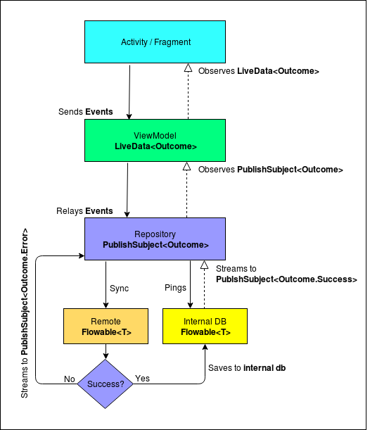

# SwvlTask

A sample app to demonstrate the building of a good, modular and scalable Android app using Kotlin, Android Architecture Components (LiveData, ViewModel & Room), Dagger, RxJava and RxAndroid among others.

# Features
Some of the features of the app include

- **Effective Networking** - Using a combination of Retrofit, Rx, Room and LiveData, we are able to handle networking in the most effective way.

- **Modular** - The app is broken into modules of features and libraries which can be combined to build instant-apps, complete apps or lite version of apps.

- **MVVM architecture** - Using the lifecycle aware viewmodels, the view observes changes in the model / repository.

- **Kotlin** - This app is completely written in Kotlin.

- **Android Architecture Components** - Lifecycle awareness has been achieved using a combination of LiveData, ViewModels and Room.

 - **Offline first architecture** - All the data is first tried to be loaded from the db and then updated from the server. This ensures that the app is usable even in an offline mode.

 - **Dependency Injection** - Common elements like `context`, `networking` interface are injected using Dagger 2.

 - **Feature based packaging** - This screen-wise / feature-wise packaging makes code really easy to read and debug.

# Networking

# Search By Movie Tittle:
i have two solution :
1- write sql subquery to search for movie by tittle:

SELECT M.*
FROM Movie M
Where Id IN (SELECT M2.ID
                    FROM Movie M2
                    WHERE M2.Year = M.Year  AND  M2.title  like ? 
 Order By M2.Rating DESC
LIMIT 5)   
Order By M.Year DESC, M.Rating  DESC;

2- use kotlin high order functions to search for the movie:

val filtered = movies
                    .filter { it.title.toLowerCase().contains(movietitle.toLowerCase()) }
                    .sortedWith(compareByDescending({ it.year }, { it.rating }))
                    .groupBy { t -> t.year }
                    .flatMap { (_, lst) -> lst.take(5) }
                    

# Testing:
To run all the unit tests, run `./gradlew test`. This would test the repositories and the viewmodels.

To run all the instrumented tests, run  `./gradlew connectedAndroidTest`. This would test the LocalDataSources (Room)

# Build info:
  - Android Studio - 3.1 Canary 8
  - Compile SDK - 28
  - MinSDK - 16, Target - 28

# Libraries used
* [Android Support Libraries](https://developer.android.com/topic/libraries/support-library/index.html)
* [Dagger 2](https://google.github.io/dagger/)
* [Retrofit](http://square.github.io/retrofit/)
* [OkHttp](http://square.github.io/okhttp/)
* [Picasso](http://square.github.io/picasso/)
* [Room](https://developer.android.com/topic/libraries/architecture/room.html)
* [ViewModel](https://developer.android.com/topic/libraries/architecture/viewmodel.html)
* [LiveData](https://developer.android.com/topic/libraries/architecture/livedata.html)
* [RxJava](https://github.com/ReactiveX/RxJava)
* [RxAndroid](https://github.com/ReactiveX/RxAndroid)

# License

    Copyright 2020 Mohammed ahmed

    
